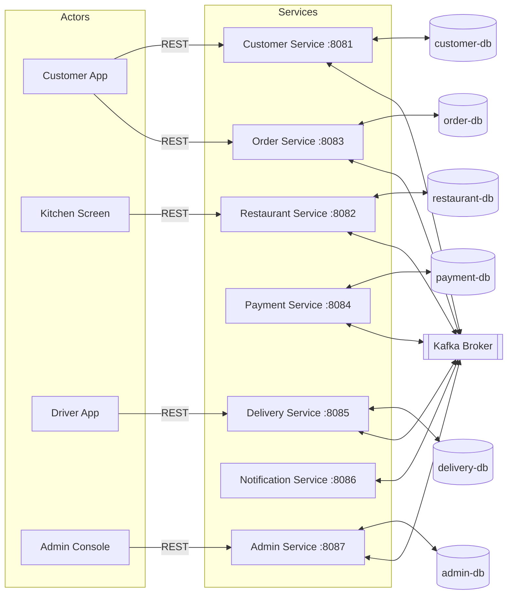
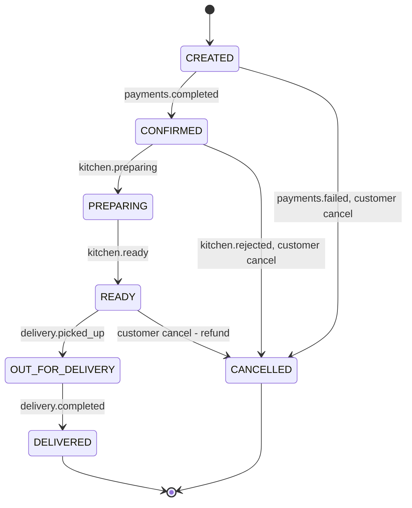
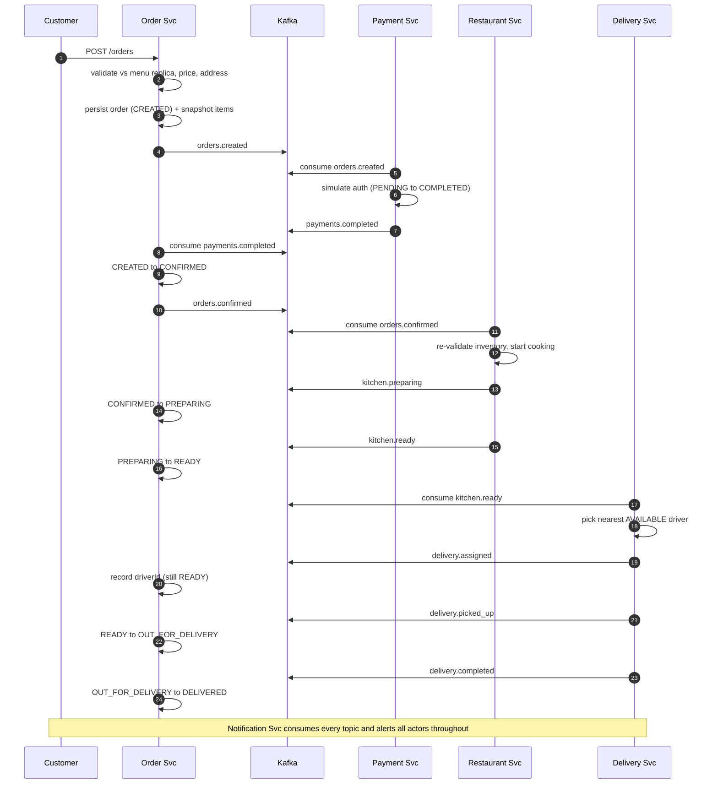
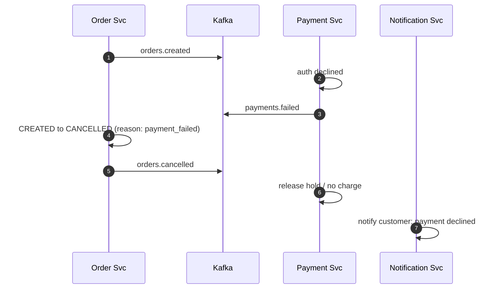

# Food Delivery Platform — Architecture & Design Document

**Version:** 1.1 · **Date:** 2026-10-04 · **Status:** Implemented — see [README.md](../README.md) for the quickstart and demo script

---

## 1. Overview & Architectural Principles

A distributed food-delivery platform coordinating four actors (Customers, Restaurants/Kitchens,
Drivers, Admins) across seven independently deployable Ballerina microservices.

**Core principles** (each is a defence talking point):

| # | Principle | Meaning in this system |
|---|-----------|------------------------|
| 1 | **Event choreography** | Services never call each other's REST APIs. All cross-service coordination happens via Kafka domain events. REST is only the front door for actors (customer app, kitchen screen, driver app, admin console). |
| 2 | **Single state authority** | The Order Service is the *only* writer of order status. Other services emit facts (`kitchen.ready`, `delivery.picked_up`); Order Service interprets them and advances the state machine, then broadcasts canonical status events. No two services can disagree about order state. |
| 3 | **Database-per-service** | Each service owns its data store; no service queries another's database. Cross-service data that must be read locally is replicated via Kafka into a **read model** (CQRS-lite). |
| 4 | **At-least-once delivery + idempotent consumers** | Kafka guarantees at-least-once. Every consumer deduplicates on `eventId`, so replayed messages are harmless. |
| 5 | **Snapshot embedded documents** | Orders embed a copy of menu items and prices at order time — a later menu price change must never mutate a historical order. |

---

## 2. System Context Diagram



---

## 3. Service Catalog

| Service | Port | Owns (data) | Produces | Consumes |
|---|---|---|---|---|
| Customer | 8081 | accounts, addresses, order-history read model | — | `orders.created`, `orders.status.changed` |
| Restaurant | 8082 | menus, inventory, opening hours, kitchen tickets | `kitchen.preparing`, `kitchen.ready`, `kitchen.rejected`, `restaurant.menu.updated` | `orders.confirmed`, `orders.cancelled` |
| Order | 8083 | orders, status history, menu replica (read model) | `orders.created`, `orders.confirmed`, `orders.cancelled`, `orders.status.changed` | `payments.*`, `kitchen.*`, `delivery.*`, `restaurant.menu.updated` |
| Payment | 8084 | payments | `payments.completed`, `payments.failed` | `orders.created`, `orders.cancelled` |
| Delivery | 8085 | drivers, deliveries | `delivery.assigned`, `delivery.picked_up`, `delivery.completed` | `orders.created` (drop-off capture), `kitchen.ready`, `orders.cancelled` |
| Notification | 8086 | notification log | — | 12 domain topics |
| Admin | 8087 | reporting read model (restaurant_stats, delivery_stats) | — | `orders.created`, `orders.confirmed`, `orders.cancelled`, `payments.completed`, `kitchen.ready`, `delivery.picked_up`, `delivery.completed` |

**Note:** Notification and Admin are "wide" consumers — they subscribe to many topics in their own
consumer group, so they receive every message independently (Kafka consumer-group semantics).

---

## 4. REST API Contracts

> Actor-facing surface. These JSON contracts map 1:1 onto Ballerina record types.

### 4.1 Customer Service (`/customers`)

| Method | Path | Description |
|---|---|---|
| POST | `/customers` | Register account |
| GET | `/customers/{id}` | Get profile |
| PUT | `/customers/{id}` | Update profile |
| GET | `/customers/{id}/addresses` | List saved addresses |
| POST | `/customers/{id}/addresses` | Add address (name, street, city, lat/lng, isDefault) |
| GET | `/customers/{id}/orders` | Order history (served from local read model — no call to Order Service) |

### 4.2 Restaurant Service (`/restaurants`)

| Method | Path | Description |
|---|---|---|
| POST | `/restaurants` | Onboard restaurant |
| GET | `/restaurants?open=true` | List/search (filter: open now) |
| GET | `/restaurants/{id}` | Details + hours |
| PUT | `/restaurants/{id}/hours` | Opening hours |
| GET | `/restaurants/{id}/menu` | Full menu |
| POST | `/restaurants/{id}/menu/items` | Add item (name, price, category, available) |
| PATCH | `/restaurants/{id}/menu/items/{itemId}` | Edit item / availability |
| PATCH | `/restaurants/{id}/inventory/{itemId}` | Real-time stock update |
| POST | `/restaurants/{id}/orders/{orderId}/preparing` | Kitchen started cooking → publishes `kitchen.preparing` |
| POST | `/restaurants/{id}/orders/{orderId}/ready` | Food ready → publishes `kitchen.ready` |
| POST | `/restaurants/{id}/orders/{orderId}/reject` | Cannot fulfil → publishes `kitchen.rejected` |

### 4.3 Order Service (`/orders`)

| Method | Path | Description |
|---|---|---|
| POST | `/orders` | Place order → 201, status `CREATED` |
| GET | `/orders/{id}` | Order with status |
| GET | `/orders?customerId=&restaurantId=&status=` | Query orders |
| POST | `/orders/{id}/cancel` | Customer cancel (validated against state machine) |
| GET | `/orders/{id}/history` | Status transition log |

**`POST /orders` request/response:**

```json
// Request (delivery address supplied inline; prices resolved server-side)
{
  "customerId": "cust_123",
  "restaurantId": "rest_456",
  "items": [ { "itemId": "item_9", "qty": 2 } ],
  "deliveryAddress": { "street": "12 Independence Ave", "city": "Windhoek", "lat": -22.5597, "lng": 17.0832 },
  "paymentMethod": "CARD"
}
// Response (prices resolved server-side from menu replica — never trusted from client)
{
  "orderId": "ord_789",
  "status": "CREATED",
  "items": [ { "itemId": "item_9", "name": "Kapana", "unitPrice": 45.00, "qty": 2, "lineTotal": 90.00 } ],
  "subtotal": 90.00,
  "deliveryFee": 15.00,
  "total": 105.00,
  "placedAt": "2026-10-04T12:03:00Z"
}
```

### 4.4 Payment Service (`/payments`)

| Method | Path | Description |
|---|---|---|
| GET | `/payments/{id}` | Payment detail |
| GET | `/payments?orderId=` | Payment for an order |

> Payments are simulated: every `orders.created` is auto-processed. Sending
> `paymentMethod: "TEST_DECLINE"` deterministically fails the payment, which
> exercises the compensation path (§7.2).

### 4.5 Delivery Service (`/delivery`)

| Method | Path | Description |
|---|---|---|
| POST | `/drivers` | Register driver (AVAILABLE by default, central Windhoek) |
| GET | `/drivers?status=AVAILABLE` | List drivers by status |
| PATCH | `/drivers/{id}/status` | AVAILABLE / OFFLINE (BUSY is service-managed) |
| PATCH | `/drivers/{id}/location` | GPS ping `{lat, lng}` *(bonus: location simulation)* |
| POST | `/deliveries/{orderId}/assign` | Manual (re)assignment when no driver was free at kitchen.ready |
| POST | `/deliveries/{orderId}/picked_up` | Driver picked up → `delivery.picked_up` |
| POST | `/deliveries/{orderId}/completed` | Driver delivered → `delivery.completed`, driver released |
| GET | `/deliveries/{orderId}` | Delivery detail |
| GET | `/deliveries?driverId=&status=` | Query deliveries |

### 4.6 Notification Service (`/notifications`)

| Method | Path | Description |
|---|---|---|
| GET | `/notifications?recipientId=` | Inbox for a recipient (feeds the UI) |

### 4.7 Admin Service (`/admin`)

| Method | Path | Description |
|---|---|---|
| GET | `/admin/reports/restaurants` | Orders count, revenue, avg prep time per restaurant |
| GET | `/admin/reports/restaurants/{id}` | Single-restaurant report |
| GET | `/admin/reports/deliveries` | Deliveries completed, avg delivery time per driver |

---

## 5. Kafka Design

### 5.1 Event Envelope (every message, on every topic)

```json
{
  "eventId": "3f2a1c9e-8b7d-4e2a-9c1d-5f6e7a8b9c0d",
  "eventType": "payments.completed",
  "occurredAt": "2026-10-04T12:03:41Z",
  "orderId": "ord_789",
  "payload": {
    "paymentId": "pay_001",
    "amount": 105.00,
    "transactionRef": "TXN-88123"
  }
}
```

### 5.2 Topic Catalog

All topics: **key = `orderId`** (`restaurant.menu.updated` is keyed by `itemId`) · **partitions = 3** · **replication factor = 1** (single broker in dev; 3 in prod) · cleanup policy `delete`, retention 7 days.

| Topic | Producer | Consumers | Purpose |
|---|---|---|---|
| `orders.created` | Order | Payment, Notification, Customer | Trigger payment |
| `payments.completed` | Payment | Order, Notification | `CREATED → CONFIRMED` |
| `payments.failed` | Payment | Order, Notification | Compensation → cancel |
| `orders.confirmed` | Order | Restaurant, Notification | Kitchen accepts order |
| `kitchen.preparing` | Restaurant | Order, Notification | `CONFIRMED → PREPARING` |
| `kitchen.ready` | Restaurant | Order, Delivery, Notification | `PREPARING → READY`; triggers driver assignment |
| `kitchen.rejected` | Restaurant | Order, Payment, Notification | Out of stock → cancel + refund |
| `restaurant.menu.updated` | Restaurant | Order | Menu/inventory replica sync for order validation |
| `delivery.assigned` | Delivery | Order, Notification | Record driver on order |
| `delivery.picked_up` | Delivery | Order, Notification | `READY → OUT_FOR_DELIVERY` |
| `delivery.completed` | Delivery | Order, Customer, Notification | `OUT_FOR_DELIVERY → DELIVERED` |
| `delivery.failed` | Delivery | Order, Notification | No driver / delivery aborted → cancel + refund |
| `orders.cancelled` | Order | Payment, Restaurant, Delivery, Customer, Notification | Fan-out compensation |
| `orders.status.changed` | Order | Customer, Admin, Notification | Catch-all stream powering read models |

**Partitioning rationale (defence point):** keying by `orderId` guarantees all events for one order
land on the same partition, hence *total ordering per order* — the invariant the state machine
depends on. Orders are independent of each other, so 3 partitions give consumer parallelism
(throughput at peak meal times) without any cross-order ordering requirement.

**Consumer groups:** one group per service (`order-service`, `payment-service`, `notification-service`, …).
Multiple replicas of a service share the group → Kafka load-balances partitions across them (horizontal scaling).

### 5.3 Delivery Semantics & Error Handling

- **At-least-once.** Consumers deduplicate via a `processed_events` collection (unique index on
  `eventId`; insert-before-process, skip if duplicate).
- **Retries:** transient failure → don't commit offset, message redelivered.
- **Dead-letter:** after 3 failed attempts, produce the raw message to `<topic>.dlq` and commit.
  Admin/dashboard monitors DLQ depth.
- **Compensation (mini-saga):** `payments.failed`, `kitchen.rejected`, or `delivery.failed` →
  Order Service transitions to `CANCELLED` and broadcasts `orders.cancelled`; Payment refunds,
  Restaurant stops cooking, Delivery releases the driver, Customer is notified.

---

## 6. Order State Machine



| From | To | Trigger | Side effects |
|---|---|---|---|
| CREATED | CONFIRMED | `payments.completed` | broadcast `orders.confirmed` |
| CREATED | CANCELLED | `payments.failed` / customer cancel | broadcast `orders.cancelled` (refund) |
| CONFIRMED | PREPARING | `kitchen.preparing` | broadcast status change |
| CONFIRMED | CANCELLED | `kitchen.rejected` / customer cancel | refund + notify |
| PREPARING | READY | `kitchen.ready` | triggers Delivery assignment |
| READY | OUT_FOR_DELIVERY | `delivery.picked_up` | notify customer |
| READY | CANCELLED | customer cancel | refund + release driver |
| OUT_FOR_DELIVERY | DELIVERED | `delivery.completed` | final notify, stats update |
| DELIVERED / CANCELLED | — | terminal | — |

**Rule:** any transition not in this table is rejected (HTTP 409 on REST, logged + skipped on Kafka)
with the reason recorded in `order_status_history`. No state skipping.

---

## 7. Sequence Diagrams

### 7.1 Happy path



### 7.2 Payment failure (compensation path)



---

## 8. Data Model (MongoDB, one database per service)

Every consumer service additionally keeps a `processed_events` collection
(unique `eventId`) as its idempotency guard (§5.3).

### 8.1 `customer-db`

- **customers** — `{_id, name, email (unique), phone, createdAt}` (authentication is future work)
- **addresses** — `{_id, customerId, label, street, city, geo: {lat, lng}, isDefault}`
- **order_history** *(read model fed by `orders.status.changed`)* — `{orderId, customerId, restaurantName, itemCount, total, status, placedAt, updatedAt}`

### 8.2 `restaurant-db`

- **restaurants** — `{_id, name, cuisine, address, geo, isOpen, openingHours: {mon: {open, close}, ...}, rating}`
- **menu_items** — `{_id, restaurantId, name, description, price, category, available}`
- **inventory** — `{restaurantId, itemId, stockQty, updatedAt}` (real-time stock, separate from menu)

### 8.3 `order-db`

- **orders** — `{_id, customerId, restaurantId, deliveryAddress (snapshot), items: [{itemId, name, unitPrice, qty, lineTotal}], subtotal, deliveryFee, total, status, driverId, paymentId, createdAt, updatedAt}`
- **order_status_history** — `{orderId, from, to, reason, causedByEventId, occurredAt}`
- **processed_events** — `{_id: eventId, topic, consumedAt}` (idempotency guard, unique `_id`)

### 8.4 `payment-db`

- **payments** — `{_id, orderId, customerId, amount, method, status: PENDING|COMPLETED|FAILED|REFUNDED, transactionRef, createdAt, updatedAt}`

### 8.5 `delivery-db`

- **drivers** — `{_id, name, phone, status: AVAILABLE|BUSY|OFFLINE, currentLocation: {lat, lng}, lastLocationAt}`
- **deliveries** — `{_id = orderId, restaurantId, customerId, driverId, pickupLocation, dropoffLocation, status: UNASSIGNED|ASSIGNED|PICKED_UP|COMPLETED|FAILED, assignedAt, pickedUpAt, deliveredAt, etaMinutes}`

### 8.6 `admin-db` *(read model fed by Kafka)*

- **restaurant_stats** — `{restaurantId, ordersCount, revenue, avgPrepMinutes, updatedAt}`
  (`avgPrep = kitchen.ready.occurredAt − orders.confirmed.occurredAt`)
- **delivery_stats** — `{driverId, completedCount, avgDeliveryMinutes, updatedAt}`
  (`avgDelivery = delivery.completed.occurredAt − delivery.picked_up.occurredAt`)

---

## 9. Container Topology (Docker Compose)

| Container | Image | Notes |
|---|---|---|
| `kafka` | `apache/kafka:3.9.0` (KRaft — no Zookeeper) | single broker, dual listeners (internal `kafka:19092`, host `localhost:9092`) |
| `kafka-init` | `apache/kafka:3.9.0` | sidecar that explicitly creates the 14 topics (3 partitions, RF 1) |
| `kafka-ui` | `provectuslabs/kafka-ui` → :8090 | inspect topics/messages during demo & defence |
| `mongo` | `mongo:7` | one instance, 6 logical databases (dev pragmatism); separate instances per service in prod |
| `mongo-express` | `mongo-express` → :8091 | browse collections during demo |
| 7 × service containers | two-stage Dockerfile: compiled on `ballerina/ballerina:2201.13.6`, run on `ballerina/jvm-runtime:4.0.0` | isolated network `food-delivery-net`; services start only after Kafka/Mongo healthchecks pass |

Configuration via `.env`: `KAFKA_BOOTSTRAP_SERVERS`, per-service `MONGO_URL`, ports.

---

## 10. Bonus Roadmap (effort-ordered)

1. **Driver Location Simulation** — `PATCH /drivers/{id}/location` + a driver simulator script; Leaflet overlay map polling driver positions.
2. **Complete UI** — single-page HTML/JS app: customer ordering flow, kitchen screen, driver view, admin dashboards.
3. **Observability** — Ballerina built-in metrics (`observabilityIncluded = true`) + Prometheus + Grafana dashboards (orders/min, Kafka consumer lag).
4. **Surge Pricing** — delivery fee scales with `pendingOrders / availableDrivers` ratio, computed in Order Service.
5. **Route Optimization** — haversine-distance ETA first; OSRM integration for real routing later.

---

## Appendix A — Suggested Team Split (so every member has commits)

| Member | Ownership |
|---|---|
| M1 | **Order Service** (state machine — the 50% core) |
| M2 | **Restaurant Service** + **Delivery Service** |
| M3 | **Payment Service** + **Notification Service** |
| M4 | **Customer Service** + **Admin Service** + docs/diagrams |
| M5 / shared | **Infra**: docker-compose, topic bootstrap, CI, README, demo scripts |

Rule of thumb: commit what you can explain. Each member owns their service's Ballerina module end-to-end.
